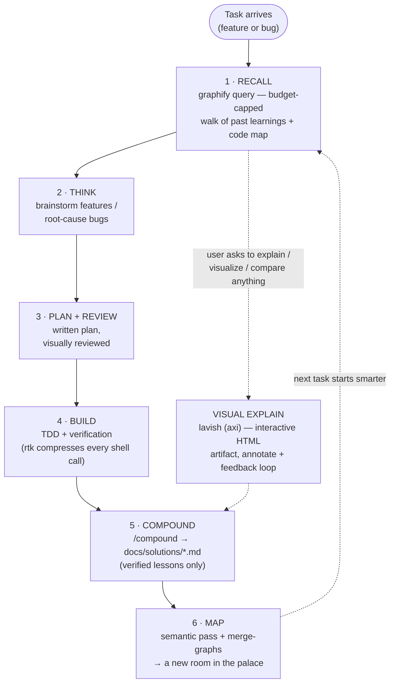

# 🏛 loci

**A memory palace for your codebase.** The ancient *method of loci* works by
placing memories at locations you can walk back through. loci does the same
for engineering knowledge: every verified learning is placed at a node in a
knowledge graph, every new task starts by walking the palace — and rtk
compresses the shell output in between. Knowledge compounds; every task makes
the next one cheaper.



Two cross-cutting branches ride alongside the numbered loop: **rtk**
compresses every shell call in every stage, and **lavish** fires whenever
something is easier shown than told — plan reviews at stage 3, but equally a
mid-task "explain this architecture to me" — rendering an interactive,
annotatable HTML artifact whose feedback flows straight back into the session.

## Why

Token efficiency has two time horizons, and most tools only address one:

| Horizon | Mechanism | Tool |
|---|---|---|
| **Within a session** | Deterministic, lossless compression of shell output (60–90% on git/test/lint) | [rtk](https://github.com/rtk-ai/rtk) |
| **Across sessions** | Learnings + code mapped into a graph; recall is one budget-capped query instead of re-grepping and re-reading | [graphify](https://github.com/Graphify-Labs/graphify) |

loci wires both into one loop, with two hard rules that keep it honest:

- **No lossy compression, no per-turn context taxes.** rtk is rule-based
  (never an ML model rewriting your context); graph recall has a hard token
  budget; learning capture is a single pass. Tools that inject rulesets
  every turn or semantically compress your history are deliberately excluded.
- **Only verified knowledge enters the palace.** Every captured learning
  requires a root cause and a Verification line with the real command +
  output. A guessed fix poisons every future session that recalls it.

## Install

```
/plugin marketplace add jnebab/loci
/plugin install loci@loci
```

Then, in any project or workspace you want the loop:

```
/workflow-init
```

The skill checks prerequisites, asks which code targets to graph, and wires
everything project-scoped — it never touches your global `~/.claude` config.

## Prerequisites

| Tool | macOS | Windows / Linux |
|---|---|---|
| [rtk](https://github.com/rtk-ai/rtk) | `brew install rtk` | prebuilt binary from releases, or `cargo install rtk` |
| [graphify](https://github.com/Graphify-Labs/graphify) | `pip install graphifyy` | `py -m pip install graphifyy` (Windows) |

Optional but recommended: the [superpowers](https://github.com/obra/superpowers)
plugin (brainstorming, systematic-debugging, writing-plans, TDD, verification)
for the think/plan/build stages, and a visual plan-review tool such as
[lavish-axi](https://github.com/kunchenguid/lavish-axi).

## What's in the box

- **`/workflow-init`** — builds the palace in a project/workspace: loop rules
  in CLAUDE.md, `docs/solutions/` learning store, `.claudeignore`
  (prompt-cache protection), project-scoped rtk hook, per-target graphify
  graphs merged into one queryable workspace graph, and an end-to-end
  verification gate.
- **`/compound`** — captures a verified learning (bug / decision / gotcha /
  pattern) as a ≤30-line markdown entry with mandatory root cause and
  verification, then places it in the graph.
- **Reference templates** — CLAUDE.md loop-rules block, solutions README,
  rtk hook JSON.

## Design notes

- **Code graphs are free.** graphify parses code with tree-sitter locally —
  zero LLM tokens. Only `docs/solutions/` markdown needs a semantic pass
  (Gemini key if available, otherwise the session model — never blocked on
  an API key).
- **Graphs live under `graphify-out/targets/<name>` and merge** via
  `graphify merge-graphs` into one workspace graph — repos stay clean of
  generated files.
- **`.claudeignore` must contain `graphify-out/` before the first extract**,
  or every rebuild invalidates Claude Code's prompt cache and silently eats
  the savings.
- **Installer overreach is reverted by design.** Both rtk's and graphify's
  installers default to mutating global config; `/workflow-init` keeps
  everything project-scoped and undoes what the installers globalize.
- **Small fresh repos:** skip the graph until learnings accumulate
  (graphify's own benchmarks show ~1x payoff on tiny corpora) — the loop
  rules, learning store, and rtk still pay off from day one.

## Measuring it

- `rtk gain` — real measured token savings from shell compression.
- `graphify query "<topic>" --budget 2000` — recall in one capped call;
  compare against what the equivalent grep + file-reading spree would cost.

## License

MIT
