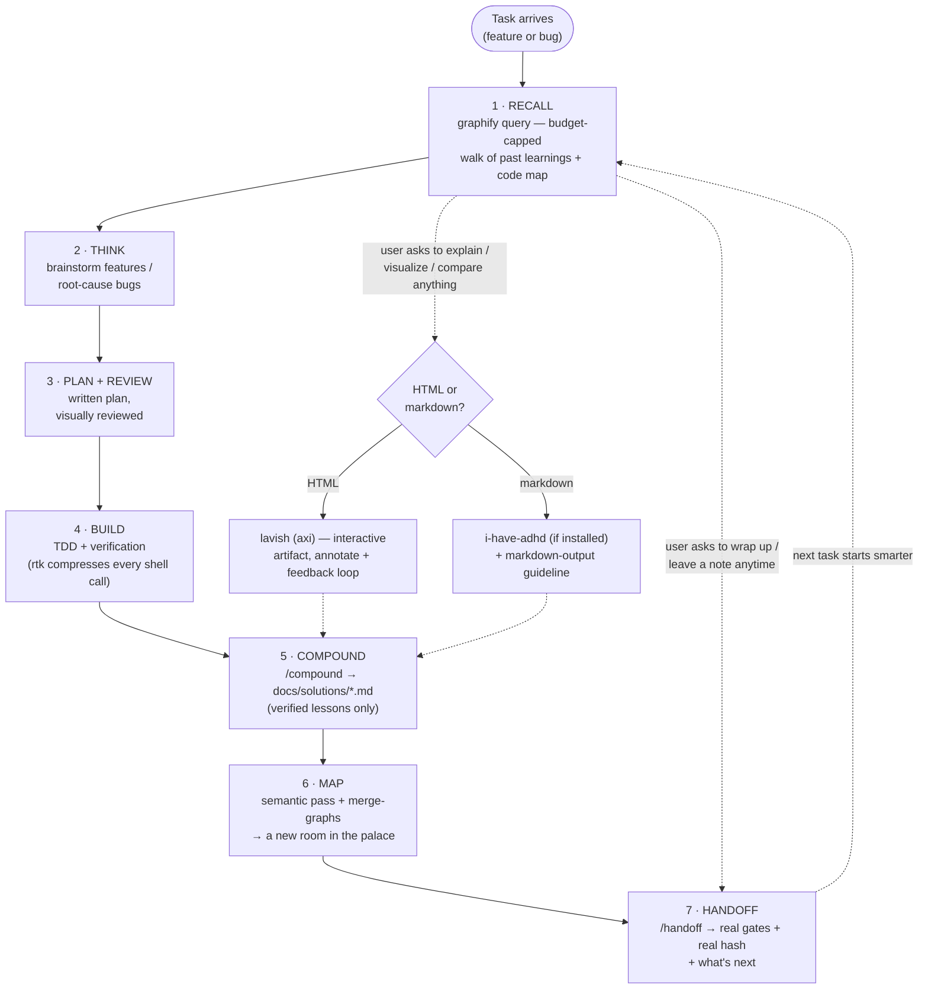

# 🏛 loci-flow

**A complete, token-efficient engineering workflow for Claude Code** — one
loop that carries every task from **recall** (what do we already know?)
through **analysis** (brainstorm features, root-cause bugs), **planning**,
**interactive visual review**, **execution** (TDD + verification), to
**knowledge capture and sharing** — with compressed shell output the whole
way through.

The *loci* half of the name is the ancient *method of loci* — the memory palace — because
that's the mechanic that makes the loop compound: every verified learning is
placed at a node in a knowledge graph, and every new task starts by walking
it. But the memory is one stage of six; the product is the whole loop.

| Stage | What happens | Powered by |
|---|---|---|
| 1 · Recall | One budget-capped graph query answers "have we seen this before, and what code is involved?" | graphify |
| 2 · Think | Features get brainstormed to an approved design; bugs get root-caused before any fix | your process skills (e.g. superpowers) |
| 3 · Plan + Review | Written plan, rendered as an interactive HTML artifact you annotate; feedback flows back automatically | writing-plans + lavish (axi) |
| 4 · Build | TDD, verification-before-completion, model routing | your process skills |
| 5 · Compound | Verified learnings (root cause + proof) captured to `docs/solutions/` | `/compound` (bundled) |
| 6 · Map | Learnings + code folded into the graph the next task recalls from | graphify |
| 7 · Handoff | Real gate output + real commit hash + what's next, written for the next session | `/handoff` (bundled) |
| ⚡ everywhere | Shell output compressed 60–90%, losslessly | rtk |
| 👁 on demand | "Explain / visualize / compare this" → HTML artifact, or structured markdown | lavish (axi) or i-have-adhd |



Two cross-cutting branches ride alongside the numbered loop: **rtk**
compresses every shell call in every stage, and **lavish** fires whenever
something is easier shown than told — plan reviews at stage 3, but equally a
mid-task "explain this architecture to me" — rendering an interactive,
annotatable HTML artifact whose feedback flows straight back into the session.

## Why

Token efficiency has two time horizons, and most tools only address one:

| Horizon | Mechanism | Tool |
|---|---|---|
| **Within a session** | Deterministic, lossless compression of shell output (60–90% on git/test/lint) | [rtk](https://github.com/rtk-ai/rtk) |
| **Across sessions** | Learnings + code mapped into a graph; recall is one budget-capped query instead of re-grepping and re-reading | [graphify](https://github.com/Graphify-Labs/graphify) |

loci-flow wires both into one loop, with two hard rules that keep it honest:

- **No lossy compression, no per-turn context taxes.** rtk is rule-based
  (never an ML model rewriting your context); graph recall has a hard token
  budget; learning capture is a single pass. Tools that inject rulesets
  every turn or semantically compress your history are deliberately excluded.
- **Only verified knowledge enters the palace.** Every captured learning
  requires a root cause and a Verification line with the real command +
  output. A guessed fix poisons every future session that recalls it.

## Why this stack

Every tool in the loop was picked for a specific job — none are bundled
just because they're popular.

- **Why [superpowers](https://github.com/obra/superpowers)** — process
  discipline for the think/plan/build stages (brainstorming,
  systematic-debugging, writing-plans, TDD, verification-before-completion).
  Referenced, not required: loci-flow's stage table calls it "your process
  skills" because any equivalent process skillset slots into the same stage.
- **Why [rtk](https://github.com/rtk-ai/rtk)** — deterministic, lossless
  compression of shell output (60–90% on git/test/lint) via a
  project-scoped hook. No ML model rewrites your context; the same bytes
  of information reach you in fewer tokens.
- **Why [graphify](https://github.com/Graphify-Labs/graphify)** — the
  cross-session memory. Recall is one budget-capped query instead of a
  re-grep-and-re-read spree; code graphs are extracted locally
  (tree-sitter, zero LLM tokens), so only `docs/solutions/` markdown ever
  needs a semantic pass.
- **Why [lavish (axi)](https://github.com/kunchenguid/lavish-axi)** — the
  HTML branch of the visual-output choice. Interactive, annotatable
  artifacts whose feedback flows back into the session — for plan reviews
  and any explanation that's genuinely a diagram, comparison, or layout.
- **Why [i-have-adhd](https://github.com/ayghri/i-have-adhd)** — the
  markdown branch. Restructures output for directness (lead with the
  action, numbered steps, no preamble/recap) when markdown is enough and
  an HTML artifact would be overkill. Optional — the bundled
  `markdown-output.md` guideline carries this path alone if it isn't
  installed.

## Considered, not used

- **[caveman](https://github.com/JuliusBrussee/caveman)** — cuts ~65% of
  *output* tokens by writing in compressed "caveman-speak." Rejected: it's
  lossy register compression, and loci-flow's hard rule is no lossy
  compression anywhere in the loop — handoffs, learnings, and PR text all
  have to stay human-trustworthy verbatim, not reconstructed from a
  compressed register. rtk is the lossless answer to the same cost
  problem, applied to shell output instead of prose.
- **[headroom](https://github.com/headroomlabs-ai/headroom)** — compresses
  tool outputs, logs, and JSON before they reach the model. Not adopted:
  it overlaps rtk's job in this loop, and running both would compress the
  same stream twice for no additional saving. Worth revisiting only if
  JSON-heavy MCP tool output becomes a dominant cost that rtk's
  command-output focus doesn't reach.

## Install

```
/plugin marketplace add jnebab/loci-flow
/plugin install loci-flow@loci-flow
```

Then, in any project or workspace you want the loop:

```
/init-loci
```

The skill checks prerequisites, asks which code targets to graph, and wires
everything project-scoped — it never touches your global `~/.claude` config.

## Prerequisites

| Tool | macOS | Windows / Linux |
|---|---|---|
| [rtk](https://github.com/rtk-ai/rtk) | `brew install rtk` | prebuilt binary from releases, or `cargo install rtk` |
| [graphify](https://github.com/Graphify-Labs/graphify) | `pip install graphifyy` | `py -m pip install graphifyy` (Windows) |

Optional but recommended: the [superpowers](https://github.com/obra/superpowers)
plugin (brainstorming, systematic-debugging, writing-plans, TDD, verification)
for the think/plan/build stages, and a visual plan-review tool such as
[lavish-axi](https://github.com/kunchenguid/lavish-axi).

## What's in the box

- **`/init-loci`** — builds the palace in a project/workspace: loop rules
  in CLAUDE.md, `docs/solutions/` learning store, `.claudeignore`
  (prompt-cache protection), project-scoped rtk hook, per-target graphify
  graphs merged into one queryable workspace graph, and an end-to-end
  verification gate.
- **`/compound`** — captures a verified learning (bug / decision / gotcha /
  pattern) as a ≤30-line markdown entry with mandatory root cause and
  verification, then places it in the graph.
- **`/viz`** — generates and opens graphify's interactive community-graph
  visualization (`graph.html`) for any graphed target: force-directed map,
  community sidebar with toggles, LLM-named clusters (via the claude CLI —
  no API key needed). Warns and offers the lighter `graphify tree` view
  past ~5000 nodes.
- **Reference templates** — CLAUDE.md loop-rules block, solutions README,
  rtk hook JSON.

## Design notes

- **Code graphs are free.** graphify parses code with tree-sitter locally —
  zero LLM tokens. Only `docs/solutions/` markdown needs a semantic pass
  (Gemini key if available, otherwise the session model — never blocked on
  an API key).
- **Graphs live under `graphify-out/targets/<name>` and merge** via
  `graphify merge-graphs` into one workspace graph — repos stay clean of
  generated files.
- **`.claudeignore` must contain `graphify-out/` before the first extract**,
  or every rebuild invalidates Claude Code's prompt cache and silently eats
  the savings.
- **Installer overreach is reverted by design.** Both rtk's and graphify's
  installers default to mutating global config; `/init-loci` keeps
  everything project-scoped and undoes what the installers globalize.
- **Small fresh repos:** skip the graph until learnings accumulate
  (graphify's own benchmarks show ~1x payoff on tiny corpora) — the loop
  rules, learning store, and rtk still pay off from day one.

## Measuring it

- `rtk gain` — real measured token savings from shell compression.
- `graphify query "<topic>" --budget 2000` — recall in one capped call;
  compare against what the equivalent grep + file-reading spree would cost.
- **Optional session usage meter** — `/init-loci` can install a zero-dependency
  Stop hook (default **off**, opt-in) that prints one line after each turn:
  current context depth in tokens plus cumulative session cost in dollars,
  read straight from the session transcript. Set `CONTEXT_BUDGET_TOKENS` in the
  copied `.claude/hooks/loci-usage.mjs` and it adds a wrap-up warning once the
  context crosses that threshold — display only, it never blocks or stops.
  It's a gauge, not a loop stage; the default install stays hook-free, honoring
  the no-per-turn-tax rule.

## License

MIT
